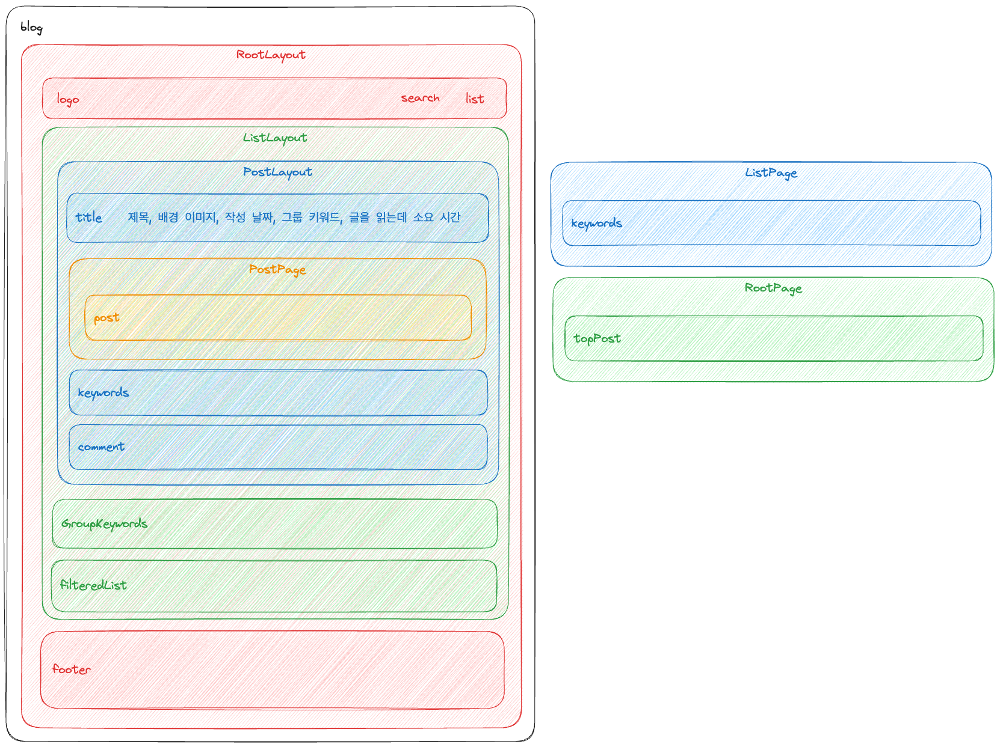

최근에 급하게 진행한 Next.js 기반 프로젝트가 있었습니다. 그때 시간이 부족해서 제대로 활용하지 못한 부분들이 아쉬웠습니다. 그래서 Next.js 기반으로 Github 블로그를 만들게 되었습니다. 이번 글을 시작으로 Github 블로그를 수정할 때마다 작성할 예정입니다.

## 잡담

먼저, Next JS에서는 아래와 같이 총 두 가지의 라우트 방식을 제공하고 있습니다.

- [App Router](https://nextjs.org/docs/app/building-your-application/routing)
- [Pages Router](https://nextjs.org/docs/pages/building-your-application/routing)

최근에 작업한 프로젝트는 [Next JS 13.4](https://nextjs.org/blog/next-13-4) 버전을 사용하고 있었지만 참고했던 예제 코드인 [blog-starter-kit](https://vercel.com/templates/next.js/blog-starter-kit)이 [Pages Router](https://nextjs.org/docs/pages/building-your-application/routing)를 사용하고 있어서 저도 자연스럽게 이 방식을 선택하게 되었습니다. ~~(고민할 시간도 없었다보니...)~~

## 방향

이번에 작업할 Github 블로그 페이지에서는 [정적 배포](https://nextjs.org/docs/app/building-your-application/deploying)와 [App Router](https://nextjs.org/docs/app/building-your-application/routing)를 이용하면서도 검색 결과에 잘 노출되도록 고려해볼 예정입니다.

정리하자면 다음과 같습니다.
1. Next JS의 [App Router](https://nextjs.org/docs/app/building-your-application/routing) 구조를 활용합니다.
2. [github Pages](https://pages.github.com/)에 맞도록 정적 배포를 진행합니다.
3. 클라이언트 사이드 랜더링을 최소화합니다.

해당 작업을 수행하기 전 이전에 참고했던 [blog-starter-kit](https://vercel.com/templates/next.js/blog-starter-kit)를 [Pages Router](https://nextjs.org/docs/pages/building-your-application/routing) 방식에서 [App Router](https://nextjs.org/docs/app/building-your-application/routing) 방식으로 [전환하는 연습을 먼저 진행](https://github.com/Sotaneum/nextjs-blog-starter-app-router)했습니다.

여기에서 [데모](https://sotaneum.github.io/nextjs-blog-starter-app-router/)를 볼 수 있습니다.

## 구조

크게 `Root`, `List`, `Post`로 구분하고 `Layout`을 통해 중복 코드를 최소화하려고 구조를 구성했습니다.

### Root

`Root Layout`에서 `Header`와 `Footer`만 가지고 있도록 하고 `Header`는 하나로 통합될 수는 있지만 우선 `로고`, `목록`, `검색`를 제공해볼 예정입니다.

`Root Page`는 3개의 최신 글만 표시할 계획이고 [blog-starter-kit](https://vercel.com/templates/next.js/blog-starter-kit)와 동일하게 크게 하나, 작은 것 두 개 이렇게 하려고 합니다.

### List

`List Layout`에서 `Keyword` 목록을 제공하고 `Keyword`에 맞는 게시글을 표시할 예정입니다.

`List Page`에서 전체 키워드를 제공하고 키워드별 결과를 제공할 예정입니다.

`keyword`는 그룹과 일반 키워드로 구분되는데, 그룹 키워드의 경우 게시글마다 테마를 적용할 때 사용합니다.

예를 들면, `Java로 리듬게임 만들기` 라는 테마가 있을 때, 이를 묶어주는 역할을 수행합니다.

### Post

`Post Layout`에서 `제목`, `키워드`, `댓글`을 제공할 예정입니다.

`Post Page`는 markdown 내용을 표시할 예정입니다.

1차 작업에 포함될 수 있을지는 모르겠으나, `글자 수`기준으로 글을 읽는데 필요한 소요 시간을 추가해볼 예정입니다.

## 기타

IDE에서 글을 작성하고 배포하는 형태라 작성했을 때 화면과 실제 화면이 동일해야하는 이슈가 있으나 천천히 정리해볼 예정입니다.

해당 블로그 코드 및 문서는 [여기](https://github.com/Sotaneum/sotaneum.github.io)에서 보실 수 있습니다.
